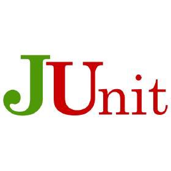

Mapa de Tecnologias - Fábrica de Software - INF/UFG 
======================================================
 
 
 

Sistemas Operacionais
======================================================

- Windows
- Ubuntu

 

Linguagens
======================================================

- Java
- HTML
- CSS
- JS
- TypeScript
- SQL

 

IDE
======================================================

- IntelliJ
- Visual Studio Code

 

Repositório
======================================================

- GitHub

## Pendências
- Repositório para dependências (ex. *Nexus*, *Artifactory*
- NPM (caso necessário)

 

Processo, Documentação e Modelagem
======================================================

- Trello
- Google Drive

## Pendências
- *Definição de modelo e ferramenta para documentação*
- *Definição ferramenta para prototipação (ex. Pencil)*
- *Incrementar e alterar documento/exercícios de ambientação*
- *Software para Gestão de tarefas/bugtracker*

 

Comunicação
======================================================

- Slack

 

DevOps
======================================================

- Jenkins

Qualidade
======================================================

- Sonar

## Mais opções
- *FindBugs*
- *Dependecy Analyzer*
- *Check Style*

 

Testes
======================================================

- JUnit
- Mockito

Container
======================================================

- Docker

Templates arquiteturais
======================================================

 

## Mapa Escolar
- Java 11
- Spring Boot
- Hibernate
- H2
- SQL Server
- Gradle
- Ionic
- NodeJS
- Angular 7

## Sempre UFG
- Java
- JSF

## Pendências
- *Definição de stack (mobile, frontend, backend)*
- *Definição de template arquitetural*
- *Definição de padrão visual*
- *POC com casos de uso padrão ex.: Perfil*
- *Obs.: Projetos para UFG devem seguir arquitetura do CERCOMP*
